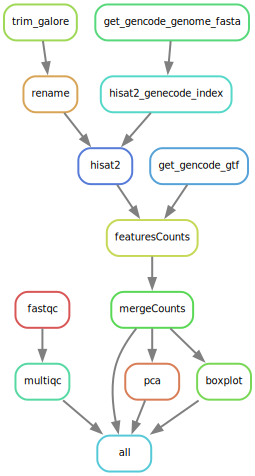

# RNA-seq (Hisat2-FeatureCounts-DeSeq2) based on Snakemake  

[](https://github.com/erwinQiao/rna-seq-hisat2-deseq2/blob/main/LICENSE) [](https://snakemake.github.io/)  [](https://bioconda.github.io/) [](https://zenodo.org/doi/10.5281/zenodo.10457103)

## Introduction

This Snakemake workflow is designed for the analysis of RNA-seq data (Hisat2-FeatureCounts-DeSeq2). It includes steps for quality control, read alignment, quantification, and differential expression analysis.  This workflow handles paired-end data. We used the data published by our previous data.  

If you use this workflow in a paper, don't forget to give credits to the authors by citing the URL of this (original) repository.  

## Overview  

The standard workflow performs the following steps:  

1. Quality control of raw reads using FastQC and aggregated report with MultiQC  
2. Trim reads with trim_galore  
3. Download the reference genome and gif  
4. Build HIAST2 index and align reads to reference genome
5. Quantify gene expression levels using FeatureCounts  
6. Merge all counts into a single file  
7. Normalize counts using TPM and FPKM  
8. Perform differential expression analysis using DeSeq2  

## Requirment  

### Install conda/miniconda  

1. Please carefully read the related docs in the miniconda web <https://docs.conda.io/projects/miniconda/en/latest/>  

2. Download the Linux or macOS files  
Linux x86_64 <https://repo.anaconda.com/miniconda/Miniconda3-latest-Linux-x86_64.sh>  
Linux arch64 <https://repo.anaconda.com/miniconda/Miniconda3-latest-Linux-aarch64.sh>  

3. install miniconda  

```{bash}
mkdir -p ~/miniconda3
wget https://repo.anaconda.com/miniconda/Miniconda3-latest-Linux-x86_64.sh -O ~/miniconda3/miniconda.sh
bash ~/miniconda3/miniconda.sh -b -u -p ~/miniconda3
rm -rf ~/miniconda3/miniconda.sh
```

### Install snakemake using mamba/conda

1. Install snakemake and conda enviroment  
**snakemake need mamba to create the enviroment.**  
If you have conda installed, you can install mamba via conda.  

Using mamba will speed up, snakemake is using mamba by default, if not installed, it will report an error, and you need to use conda according to the prompts.  

```{bash}
# install mamba  
conda install -y -c conda-forge mamba  

# create the directory
mkdir snakemake
cd snakemake
git clone https://github.com/erwinQiao/rna-seq-hisat2-deseq2.git

# if you canot use git, you can download the rna-seq-hisat2-deseq2.zip and unzip it.  
# or you can git from gitee  
git clone git@gitee.com:erwinqiao/rna-seq-hisat2-deseq2.git
```

2. Install the required snakemake  

```{bash}
# install snakemake via mamba
mamba create -c conda-forge -c bioconda -n snakemake snakemake 

# install snakemake via conda
conda create -c conda-forge -c bioconda -n snakemake snakemake

# activate the conda enviroment
conda activate snakemake
```

### Run workflow  

Step1 Activate the conda enviroment

```{bash}
conda activate snakemake

# checke snakemake version
snakemake --version
snakemake -v
```

If you are slow to build env, you can create the environment first and then install snakemake  

```{bash}
conda create -n snakemake  

conda activate snakemake  

conda install -c conda-forge -c bioconda snakemake
mamba install -c conda-forge -c bioconda snakemake
```

**Attention: Syntax for Conda has changed in Snakemake 8.0 and later!**

In the new versions of Snakemake, the syntax for using Conda environments has been adjusted. Please check the help:

`snakemake --help`

**Step2 Input samples.csv etal**  

You need to verify if the data names, groups, and samples are consistent with sample.csv.  
In the config/config.yaml, you can choose the ensembl using homo_sapiens 110 fasta (gtf) or genecode human 44 fasta(gtf). You need to fill by your choose.

Step3 Run workflow  

```{bash}
# set the cores nubmer by yourself

snakemake --cores number -s workflow/Snakefile --use-conda  
```

Step4 Rerun  

if you accidentally interrupt the program and have unfinished tasks, you can use the following command to resume the execution and ensure that the incomplete tasks are successfully completed:  

`snakemake --cores 90 --use-conda -s workflow/Snakefile --rerun-incomplete`  

## Inverstagte results  

### Check the process  

When you run the workflow, you can see the process of the workflow in the terminal.  

```{text}
Job stats:  
job                      count
------------------------  -------
all                             1  
boxplot                         1
fastqc                         12  
featuresCounts                  6  
get_ensembl_genome_fasta        1  
get_ensembl_gtf                 1  
hisat2                          6  
hisat2_ensembl_index            1  
mergeCounts                     1  
multiqc                         1  
rename                          6  
trim_galore                     6  
total                          43 
```

If you have resources, you can skip the steps of downloading the genome and building the index during the process, thus reducing both space and time. However, you must ensure that the files are complete.  

```{text}
Job stats:  
job                     count  
--------------------  -------
all                         1  
boxplot                     1
fastqc                     30  
featuresCounts             15  
hisat2                     15  
hisat2_ensembl_index        1  
mergeCounts                 1  
multiqc                     1  
rename                     15  
trim_galore                15  
total                      95  
```

### Check the results  

The results are in the `results` folder.  Use `tree -h -d`to check the tree of the results  

The results contains three folders of **logs**, **results**, **resources**. The contents of each folder refer to the following contents  

```{text}

├── [4.0K]  config
├── [4.0K]  logs
│   ├── [4.0K]  fastqc
│   ├── [4.0K]  featureCounts
│   ├── [4.0K]  hisat2
│   │   ├── [4.0K]  align
│   │   └── [4.0K]  index
│   ├── [4.0K]  mergeCount
│   ├── [4.0K]  multiqc
│   ├── [4.0K]  plot
│   ├── [4.0K]  resources
│   └── [4.0K]  trim_galore
├── [4.0K]  reads
├── [ 16K]  resources
│   └── [ 28K]  hisat2_index_Homo_sapiens
├── [4.0K]  results
│   ├── [4.0K]  featureCounts
│   ├── [4.0K]  mapped
│   ├── [4.0K]  mergeCounts
│   ├── [4.0K]  plot
│   ├── [4.0K]  qc
│   │   ├── [4.0K]  fastqc
│   │   └── [4.0K]  multiqc_data
│   └── [4.0K]  trimmed
└── [4.0K]  workflow
    ├── [4.0K]  envs
    ├── [4.0K]  rules
    └── [4.0K]  scripts
        └── [4.0K]  __pycache__

```

The `config` folder contains the configuration file of the pipeline.  
The `logs` folder contains the log files of the pipeline.  
The `reads` folder contains the raw reads.  
The `resources` folder contains the resources of the pipeline.  
The `results` folder contains the results of the pipeline.  
The `workflow` folder contains the workflow of the pipeline.  

The main limitation of this pipeline is that it requires a relatively large hard disk. Since `tmp` is not used, all files are retained for subsequent use. At the same time, gene.fasta, index and DESEq2 are not added because of the problem of multi-group comparison.  

### Check the DAG  

You can check the DAG of the pipeline by running the following command:  

```bash
snakemake --dag results/plot/ViolinplotFPKM.pdf | dot -Tsvg > dag.svg
```


